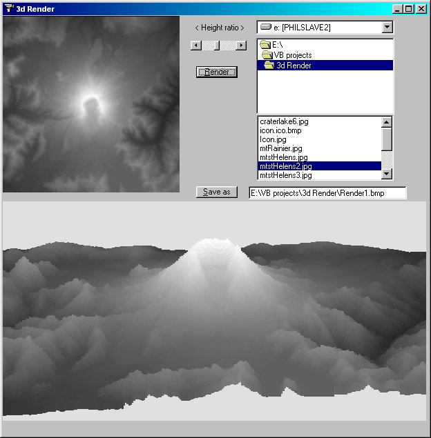



## Render 3d

### Description

Produce true 3d rendered images in VB. It's true, very simple code to produce really stunning results (see the screenshots) works best on 256 * 256 greyscale .jpg's or .bmp's as used in DEM's (Data Elevation Models) renders images based on colour of pixels (white = highest, black = lowest), allows for depth of vision using a little bit of maths. You have the option to choose bitmaps, change the height ratio & render it. Nothing too fancy, ( took me an hour & a half) will work on improving it if I get a few globes :-) . Hope U like it.
 
### More Info
 

             |
---                |---
**Submitted On**   |2002-03-21 19:38:20
**By**             |[Phil Grossman](https://github.com/Planet-Source-Code/PSCIndex/blob/master/ByAuthor/phil-grossman.md)
**Level**          |Intermediate
**User Rating**    |4.7 (84 globes from 18 users)
**Compatibility**  |VB 5\.0, VB 6\.0
**Category**       |[Graphics](https://github.com/Planet-Source-Code/PSCIndex/blob/master/ByCategory/graphics__1-46.md)
**World**          |[Visual Basic](https://github.com/Planet-Source-Code/PSCIndex/blob/master/ByWorld/visual-basic.md)
**Archive File**   |[Render\_3d642473212002\.zip](https://github.com/Planet-Source-Code/phil-grossman-render-3d__1-32924/archive/master.zip)

